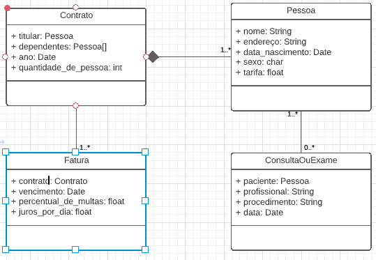

# POO - Atividade - Classes e objetos

# Respostas:
## 1. Explique os termos a seguir:

**a. Classe:**  
Uma classe é como um molde que define as características e comportamentos que um objeto terá.

**b. Objeto:**  
Um objeto é a realização de uma classe, representando algo do mundo real. Ele tem características próprias (valores dos atributos) e ações que pode executar (métodos ou funções).

**c. Referência:**  
Referência é o endereço na memória que aponta para um objeto. Quando um objeto é criado, ele é armazenado em um local específico da memória, e as variáveis que "guardam" esse objeto na verdade guardam a referência para ele, permitindo que o programa acesse e manipule o objeto.

**d. Instância:**  
Instância é o termo usado para se referir a um objeto específico que foi criado a partir de uma classe. Quando dizemos que um objeto é uma instância de uma classe, estamos dizendo que ele foi criado utilizando a estrutura dessa classe.

## 2. Diagrama de classes

## 3. Implementação das classes
[Código implementado](https://github.com/deboradls/POO/blob/main/AtividadeClassesEObjetos/AtividadeClassesEObjetos.java)